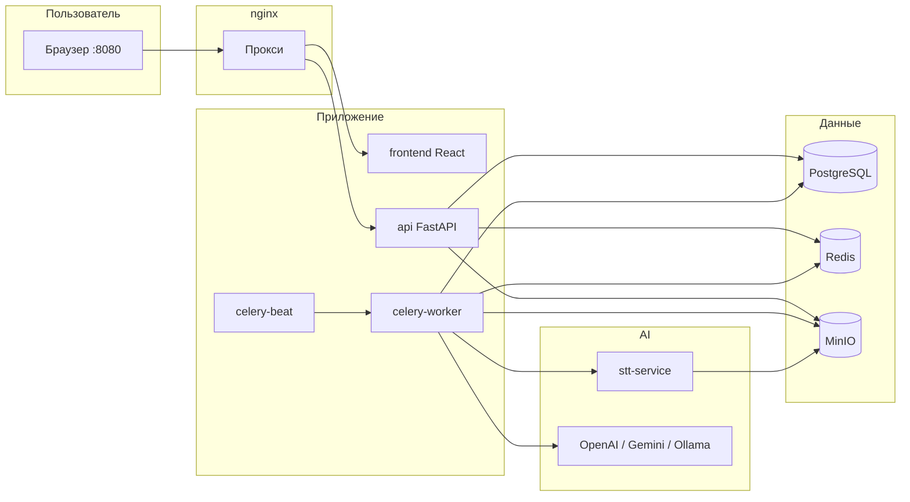

# Архитектура

## Общая схема



## Репозиторий

```
CCSA/
├── backend/           # API + Celery + STT (Python)
│   ├── app/           # FastAPI, модели, сервисы
│   ├── worker/        # Celery tasks, ASR limiter
│   ├── stt/           # Сервис распознавания (отдельный процесс)
│   └── alembic/       # Миграции БД
├── frontend/          # React SPA
├── nginx/             # Конфиг прокси
├── models/            # CT2-модели (не в git)
├── docs/              # Документация
└── docker-compose.yml
```

## Backend (`app/`)

| Модуль | Назначение |
|--------|------------|
| `api/auth` | Сессия, логин |
| `api/calls` | Список звонков, карточка, теги, заметки, retranscribe/reanalyze |
| `api/dashboard` | Сводка, метрики виджетов, layout конструктора |
| `api/operators` | Операторы, синхронизация |
| `api/scenarios` | Сценарии оценки и критерии |
| `api/playground` | Тестовые сессии, загрузка файлов |
| `api/research` | LLM метаанализ по выборке звонков |
| `api/settings` | Модели AI, Webitel, автоматизация, пользователи |
| `services/llm.py` | Промпт, JSON Schema, провайдеры LLM, cohort-анализ (`run_cohort_analysis`) |
| `services/research_query.py` | Выборка звонков с транскриптом для исследований |
| `services/pii.py` | Анонимизация перед облачным LLM |
| `services/storage.py` | MinIO upload/download |

## Worker (`worker/`)

| Задача | Описание |
|--------|----------|
| `webitel.sync_webitel_calls` | Загрузка записей из Webitel (по расписанию) |
| `pipeline.transcribe_call` | ASR одного звонка |
| `pipeline.analyze_call` | LLM-анализ |
| `pipeline.process_pending_batch` | Очередь pending/transcribed (каждые 5 мин) |
| `pipeline.recover_stuck_calls` | Возврат брошенных обработок в очередь (каждые 10 мин) |
| `pipeline.backfill_topics` | Классификация тем у звонков без темы (по кнопке) |
| `playground.process_playground_file` | ASR + LLM для файла плейграунда |
| `research.run_research_study` | LLM метаанализ по выборке звонков |

Ограничение параллельных запросов к STT: `worker/asr_limit.py` (Redis, токены с TTL).

Блокировки задач на звонок: `worker/task_lock.py` (Redis, ключи с TTL). Статус звонка —
состояние для пользователя, не примитив синхронизации: упавший worker освобождает лок по TTL,
а `recover_stuck_calls` возвращает звонок в очередь. Подробнее: [pipeline.md](pipeline.md#блокировки-и-восстановление).

## STT (`stt/`)

Отдельный FastAPI-процесс на порту 8001.

- Движки: **faster-whisper (CT2)** или **transformers** pipeline
- Диаризация: `stereo_channels` (левый/правый канал), `pyannote`, `mono`
- Endpoint: `POST /transcribe` — один файл (`storage_key` в MinIO)

## Frontend

- React Router, TanStack Query
- Страницы: дашборд (конструктор виджетов), звонки, операторы, сценарии, **исследования** (`/research`), плейграунд, настройки
- Аудио: WaveSurfer, транскрипт с seek

## Исследования

См. [research.md](research.md). Кратко: UI → API → Celery `run_research_study` → выборка транскрибированных звонков → LLM Markdown-отчёт в `research_studies`.

## Безопасность

- Пароли: bcrypt
- Секреты настроек: Fernet (`SETTINGS_ENCRYPTION_KEY`)
- Сессии через cookie (см. `api/auth`)
- Роли: admin / supervisor (настройки — admin)
