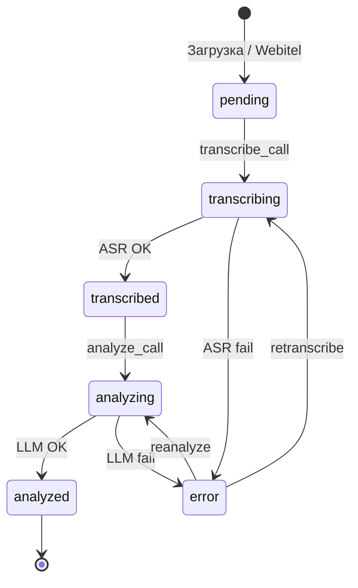
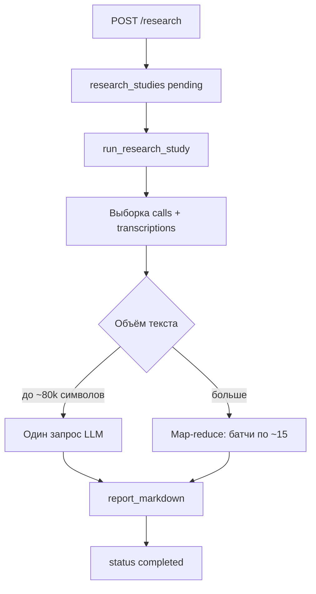

# Пайплайн обработки

## Жизненный цикл звонка



| Статус | Значение |
|--------|----------|
| `pending` | Аудио есть, ASR не запущен |
| `transcribing` | Идёт распознавание |
| `transcribed` | Текст готов, ждёт LLM |
| `analyzing` | Идёт оценка LLM |
| `analyzed` | Готово |
| `error` | Ошибка (см. `error_message`) |

## 1. Загрузка аудио

**Webitel (автоматически):**

- `celery-beat` → `sync_webitel_calls` (по cron, по умолчанию каждые 30 мин)
- Скачивание WAV → MinIO (`calls/…`)
- Запись в `calls` со статусом `pending`

**Плейграунд / ручная загрузка:**

- Файлы в MinIO (`playground/…`)
- После «Сохранить в общую базу» → `calls` с `source=playground`

## 2. ASR (распознавание)

Задача `transcribe_call`:

1. Статус → `transcribing`
2. Семафор Redis (`asr_max_parallel` из настроек)
3. `POST http://stt-service:8001/transcribe` с `storage_key`
4. Сохранение `transcriptions`: `full_text`, `utterances`, `model_name`
5. Статус → `transcribed`
6. Постановка в очередь `analyze_call`

**Что уходит в STT:** один аудиофайл из MinIO.  
**Диаризация:** реплики с `speaker` (`agent` / `client`) в `utterances`.

**Что уходит в LLM:** только `full_text` (склейка реплик **без** меток спикера). Для учёта ролей в промпте нужна доработка.

## 3. LLM (анализ)

Задача `analyze_call`:

1. Статус → `analyzing`
2. Выбор сценария (звонок / правило автоматизации / активный)
3. Опционально PII-маскирование транскрипта
4. Промпт собирается в `app/services/llm.py`:

```
{system_prompt сценария}

Оцени транскрипт разговора колл-центра. Ответ — только JSON.

Критерии:
- "greeting" (Приветствие, max 15, ...): {промпт критерия}
...

Транскрипт:
{текст}
```

5. OpenAI: `response_format` JSON Schema по ключам критериев
6. Сохранение `analysis_results`
7. Статус → `analyzed`

## 4. Очередь пакетной обработки

`process_pending_batch` (каждые 5 мин):

- Берёт до `batch_size` звонков (`pending` или `transcribed`)
- `pending` → `transcribe_call.delay`
- `transcribed` → `analyze_call.delay`

Это **не** batch ASR в одном запросе — отдельная Celery-задача на звонок.

## Плейграунд

1. Создать сессию → загрузить `.mp3` / `.wav`
2. «Запустить анализ»
3. При `playground_sequential=true` — один файл за раз
4. ASR → LLM → статус `ready`
5. «Сохранить в общую базу звонков» → копия в `calls` как `analyzed`

## Повторная обработка

| Действие в UI | API | Эффект |
|---------------|-----|--------|
| Повторное распознавание (ASR) | `POST /calls/{id}/retranscribe` | Удаляет старый транскрипт и анализ, заново ASR → LLM |
| Повторный анализ (LLM) | `POST /calls/{id}/reanalyze` | Только LLM по текущему тексту |

## 5. Исследования (LLM метаанализ)

Отдельный поток — **не часть жизненного цикла одного звонка**. Запускается вручную из UI или API.



1. Пользователь задаёт промпт и фильтры (даты, направление, оператор).
2. API проверяет лимит `RESEARCH_MAX_CALLS` и ставит Celery-задачу `run_research_study`.
3. Worker выбирает звонки с **непустым** `transcriptions.full_text`.
4. `run_cohort_analysis` в `app/services/llm.py` формирует Markdown-отчёт.
5. Результат в `research_studies.report_markdown`.

Подробнее: [research.md](research.md).
