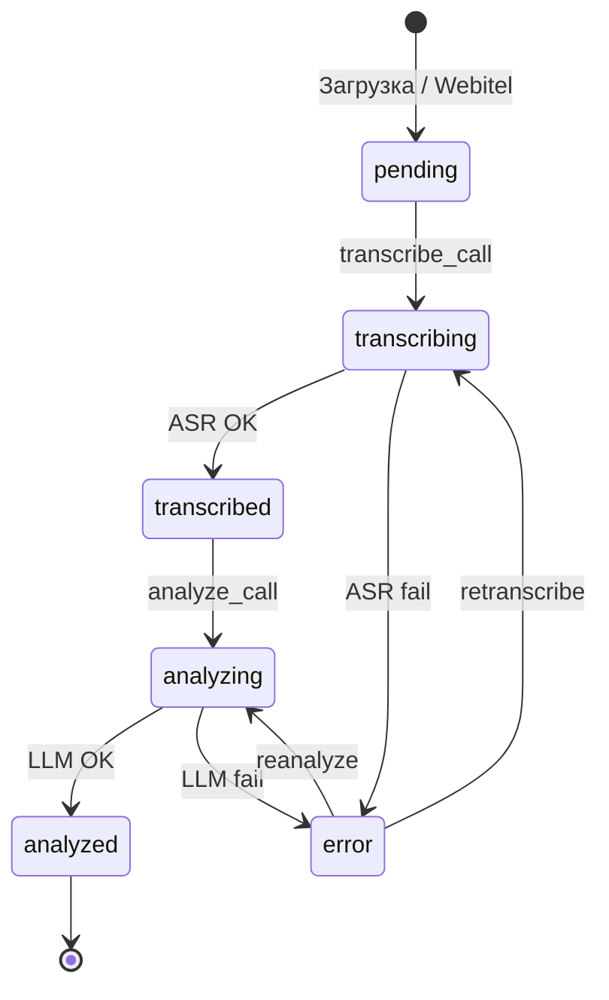
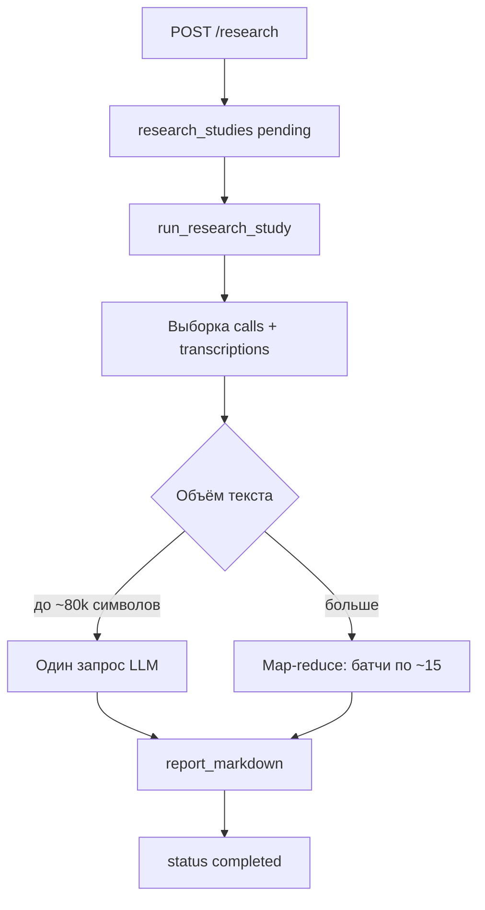

# Пайплайн обработки

## Жизненный цикл звонка



| Статус | Значение |
|--------|----------|
| `pending` | Аудио есть, ASR не запущен |
| `transcribing` | Идёт распознавание |
| `transcribed` | Текст готов, ждёт LLM |
| `analyzing` | Идёт оценка LLM |
| `analyzed` | Готово |
| `error` | Ошибка (см. `error_message`) |

Статус — **отображение состояния для пользователя**, а не блокировка. За конкурентность
отвечают Redis-локи (см. [Блокировки и восстановление](#блокировки-и-восстановление)).

## 1. Загрузка аудио

**Webitel (автоматически):**

- `celery-beat` → `sync_webitel_calls` (по cron, по умолчанию каждые 30 мин)
- Скачивание WAV → MinIO (`calls/…`)
- Запись в `calls` со статусом `pending`

**Плейграунд / ручная загрузка:**

- Файлы в MinIO (`playground/…`)
- После «Сохранить в общую базу» → `calls` с `source=playground`

## 2. ASR (распознавание)

Задача `transcribe_call`:

1. Статус → `transcribing`
2. Семафор Redis (`asr_max_parallel` из настроек)
3. `POST http://stt-service:8001/transcribe` с `storage_key`
4. Сохранение `transcriptions`: `full_text`, `utterances`, `model_name`
5. Статус → `transcribed`
6. Постановка в очередь `analyze_call`

**Что уходит в STT:** один аудиофайл из MinIO.  
**Диаризация:** реплики с `speaker` (`agent` / `client`) в `utterances`.

**Что уходит в LLM:** склейка `utterances` с ролями `[agent]` / `[client]` и таймкодом; если реплик нет — `full_text`.

## 3. LLM (анализ)

Задача `analyze_call`:

1. Захват лока `ccsa:lock:analyze:{call_id}` в Redis (TTL 30 мин)
2. Статус → `analyzing` **отдельной транзакцией**
3. Выбор сценария (звонок / правило автоматизации / активный)
4. Опционально PII-маскирование транскрипта
5. Промпт собирается в `app/services/llm.py`:

```
{system_prompt сценария}

Оцени транскрипт разговора колл-центра. Ответ — только JSON.

Критерии:
- "greeting" (Приветствие, max 15, ...): {промпт критерия}
...

Транскрипт:
{текст}
```

6. OpenAI: `response_format` JSON Schema по ключам критериев
7. Сохранение `analysis_results` — **прежний вердикт удаляется**, чтобы повторный
   анализ не давал две строки на один звонок (иначе дашборд считает звонок дважды)
8. Статус → `analyzed`

Вызов LLM выполняется **вне** транзакции записи: она может длиться минуты, и удерживать
блокировку строки всё это время нельзя.

**Строгий режим.** В пайплайне `analyze_transcript(strict=True)`: если ключ не задан или
модель не вернула валидный JSON, поднимается `LLMUnavailableError` и звонок получает статус
`error` с текстом причины. Без строгого режима (плейграунд, исследования) возвращается
заглушка. Заглушка со статусом `analyzed` выглядела бы как настоящая оценка и портила метрики.

## 4. Очередь пакетной обработки

`process_pending_batch` (каждые 5 мин):

- Берёт до `batch_size` звонков (`pending` или `transcribed`)
- `pending` → `transcribe_call.delay`
- `transcribed` → `analyze_call.delay`

Это **не** batch ASR в одном запросе — отдельная Celery-задача на звонок.

> Задача **молча пропускается вне окна автоматизации** (дни недели и время из
> **Настройки → Автоматизация**). Причина пишется в лог:
> `Pending batch skipped: outside automation window (09:00–18:00, days=[0,1,2,3,4])`.
> Ручные «Повторный анализ» и «Повторное распознавание» работают в любое время.

## Блокировки и восстановление

Раньше роль блокировки играл сам статус: задача выходила, если видела `analyzing`. Это
приводило к взаимной блокировке — API выставлял статус перед постановкой задачи, а worker
считал его признаком чужой работы и не начинал анализ. Звонок оставался в `analyzing` навсегда.

Теперь блокировки живут в Redis (`backend/worker/task_lock.py`):

| Ключ | Задача | TTL |
|------|--------|-----|
| `ccsa:lock:analyze:{call_id}` | `analyze_call` | 30 мин |
| `ccsa:lock:transcribe:{call_id}` | `transcribe_call` | 60 мин |

- TTL гарантирует, что упавший worker освобождает лок сам.
- Если Redis недоступен, работа продолжается **без** дедупликации — это лучше, чем остановка пайплайна.
- `POST /calls/{id}/reanalyze` и `/retranscribe` отдают `409` по наличию лока, а не по статусу,
  поэтому «залипший» статус не блокирует повторную попытку.

**Задача `recover_stuck_calls`** (каждые 10 мин, плюс кнопка в **Настройки → Качество**):

1. Находит звонки в `downloading` / `transcribing` / `analyzing` с `updated_at` старше 30 минут.
2. Пропускает те, у которых лок ещё удерживается — активные обработки не прерываются.
3. Возвращает остальные в очередь: `analyzing` с транскриптом → `transcribed`, иначе → `pending`
   (при наличии аудио) или `error`.

Поле `calls.updated_at` (миграция `005`) нужно именно для определения давности.

Ошибки пишутся **отдельной транзакцией** (`_mark_call`): раньше `status = error` выставлялся
в той же сессии, что откатывалась при `raise`, и причина не доходила до базы.

## Плейграунд

1. Создать сессию → загрузить `.mp3` / `.wav`
2. «Запустить анализ»
3. При `playground_sequential=true` — один файл за раз
4. ASR → LLM → статус `ready`
5. «Сохранить в общую базу звонков» → копия в `calls` как `analyzed`

## Повторная обработка

| Действие в UI | API | Эффект |
|---------------|-----|--------|
| Повторное распознавание (ASR) | `POST /calls/{id}/retranscribe` | Удаляет старый транскрипт и анализ, заново ASR → LLM |
| Повторный анализ (LLM) | `POST /calls/{id}/reanalyze` | Только LLM по текущему тексту, прежний вердикт заменяется |
| Восстановить зависшие звонки | `POST /settings/maintenance/recover-stuck-calls` | Возвращает в очередь брошенные обработки |

## 5. Исследования (LLM метаанализ)

Отдельный поток — **не часть жизненного цикла одного звонка**. Запускается вручную из UI или API.



1. Пользователь задаёт промпт и фильтры (даты, направление, оператор).
2. API проверяет лимит `RESEARCH_MAX_CALLS` и ставит Celery-задачу `run_research_study`.
3. Worker выбирает звонки с **непустым** `transcriptions.full_text`.
4. `run_cohort_analysis` в `app/services/llm.py` формирует Markdown-отчёт.
5. Результат в `research_studies.report_markdown`.

Подробнее: [research.md](research.md).
