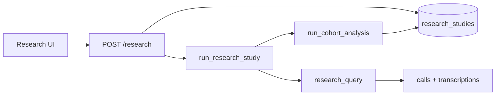

# Исследования (LLM метаанализ)

Раздел **«Исследования»** в UI (`/research`) — инструмент для **сводного анализа группы звонков** по произвольному промпту. Это не оценка качества по сценарию (как на карточке звонка), а исследовательский отчёт по выборке.

## Назначение

| Per-call QA (`AnalysisResult`) | Метаанализ (`ResearchStudy`) |
|--------------------------------|------------------------------|
| Сценарий + критерии | Свободный промпт пользователя |
| JSON: баллы, чек-лист | Markdown-отчёт |
| Один звонок | Выборка по фильтрам |
| Автоматически после ASR | Запуск вручную из UI |

**Примеры вопросов для промпта:**

- Какие основные причины недовольства клиентов в марте?
- Какие темы чаще всего повторяются во входящих звонках?
- Есть ли различия в формулировках операторов X и Y?

## Поток данных



1. Пользователь задаёт **название**, **промпт** и **фильтры** звонков.
2. API создаёт запись `research_studies` со статусом `pending` и ставит Celery-задачу.
3. Worker выбирает звонки с **готовым транскриптом** (`transcriptions.full_text` не пустой).
4. LLM формирует **один сводный Markdown-отчёт** (single-shot или map-reduce при большом объёме).
5. Статус → `completed`, отчёт доступен в UI и через API.

## Фильтры выборки

| Поле | Тип | Описание |
|------|-----|----------|
| `date_from` | `YYYY-MM-DD` | Начало периода (`call_timestamp`) |
| `date_to` | `YYYY-MM-DD` | Конец периода (включительно, до 23:59:59) |
| `direction` | `inbound` / `outbound` | Направление звонка (опционально) |
| `operator_id` | int | ID оператора из `/operators` (опционально) |
| `queue` | string | Очередь / команда оператора (`operators.team_name`) |
| `tag` | string | Тег звонка (`call_tags.tag`) |
| `score_op` | string | `eq`, `lt`, `gt` — сравнение с `score_value` |
| `score_value` | int | Оценка LLM (0–100), последний анализ звонка |

Пустые фильтры = все звонки с транскриптом (в пределах лимита).

**Важно:** в выборку попадают только звонки **с транскриптом**. Звонки в статусе `pending` / `transcribing` без текста не учитываются.

## Лимиты

| Параметр | По умолчанию | Где задать |
|----------|--------------|------------|
| Макс. звонков в одном исследовании | **200** | `RESEARCH_MAX_CALLS` в `.env` |

Перед запуском используйте **«Проверить выборку»** (`POST /research/preview`). Если `count > max_calls`, API вернёт `400` с просьбой сузить фильтры.

## LLM

- Провайдер и модель — из **Настройки → Модели и AI** (OpenAI, Gemini, Ollama).
- Перед отправкой в облако применяется **PII-маскирование** (если включено в настройках).
- При объёме до ~80k символов — один запрос к LLM.
- При большем объёме — **map-reduce**: батчи по ~15 звонков → промежуточные выводы → финальный синтез.

Отчёт сохраняется в `research_studies.report_markdown`.

## Статусы исследования

| Статус | Значение |
|--------|----------|
| `pending` | В очереди Celery |
| `running` | Идёт анализ |
| `completed` | Отчёт готов |
| `error` | Ошибка (см. `error_message`) |

На странице исследования статус обновляется через **SSE** (`GET /research/{id}/events`) — как в плейграунде: этапы загрузки, батчи LLM, завершение.

## UI

| Путь | Экран |
|------|--------|
| `/research` | Список исследований |
| `/research/new` | Создание: промпт, фильтры, preview, запуск |
| `/research/{id}` | Параметры, статус, Markdown-отчёт |

## API

Базовый префикс: `/api/v1/research`. Требуется авторизация (cookie).

### Preview выборки

```http
POST /api/v1/research/preview
Content-Type: application/json

{
  "filters": {
    "date_from": "2026-03-01",
    "date_to": "2026-03-31",
    "direction": "inbound",
    "operator_id": 3
  }
}
```

Ответ:

```json
{
  "count": 42,
  "max_calls": 200
}
```

### Создание и запуск

```http
POST /api/v1/research
Content-Type: application/json

{
  "title": "Жалобы на Paynet — март",
  "prompt": "Какие основные причины недовольства клиентов? Выдели повторяющиеся темы и приведи цитаты.",
  "filters": {
    "date_from": "2026-03-01",
    "date_to": "2026-03-31"
  }
}
```

Ответ `201`: объект исследования (`id`, `status: "pending"`, …). Celery-задача стартует автоматически.

### Список и детали

```http
GET /api/v1/research?page=1&page_size=20
GET /api/v1/research/{id}
DELETE /api/v1/research/{id}
GET /api/v1/research/{id}/export?format=md
GET /api/v1/research/{id}/export?format=json
```

**Экспорт** доступен для исследований со статусом `completed`. Markdown включает параметры, промпт и отчёт; JSON — полную структуру (включая `call_ids`, `filters`, `report_markdown`).

Полное описание endpoints: [api.md](api.md#research-llm-метаанализ).

## База данных

Таблица `research_studies` (миграция `002_research_studies`):

| Поле | Назначение |
|------|------------|
| `title`, `prompt` | Название и промпт |
| `filters_json` | Сохранённые фильтры |
| `status`, `error_message` | Состояние задачи |
| `user_id` | Автор |
| `call_count`, `call_ids` | Сколько и какие звонки вошли в отчёт |
| `llm_model` | Модель на момент запуска |
| `report_markdown` | Итоговый отчёт |
| `created_at`, `finished_at` | Временные метки |

Применить миграцию:

```bash
make migrate
```

## Код (для разработчиков)

| Компонент | Путь |
|-----------|------|
| API | `backend/app/api/research.py` |
| Схемы | `backend/app/schemas/research.py` |
| Выборка звонков | `backend/app/services/research_query.py` |
| LLM cohort | `backend/app/services/llm.py` → `run_cohort_analysis` |
| Celery | `backend/worker/tasks/research.py` |
| UI | `frontend/src/pages/Research*.tsx` |

Тесты: `backend/tests/test_research_query.py`.

## Устранение неполадок

**Исследование в статусе `error`**

- Проверьте ключ LLM в **Настройки → Модели и AI**.
- Логи worker: `docker compose logs celery-worker --tail 100`.
- Текст ошибки на странице исследования (`error_message`).

**«По выбранным фильтрам нет звонков с транскриптом»**

- Убедитесь, что звонки прошли ASR (`status` = `analyzed` или `transcribed`).
- Расширьте период дат или снимите фильтр по оператору/направлению.

**«Слишком много звонков»**

- Сузьте период или добавьте фильтр по оператору.
- Увеличьте `RESEARCH_MAX_CALLS` (осторожно: рост времени и стоимости LLM).

**Долгое выполнение**

- Большая выборка → map-reduce (несколько вызовов LLM).
- Проверьте, что `celery-worker` запущен и не перегружен задачами ASR.

См. также [troubleshooting.md](troubleshooting.md#исследования-llm-метаанализ).
